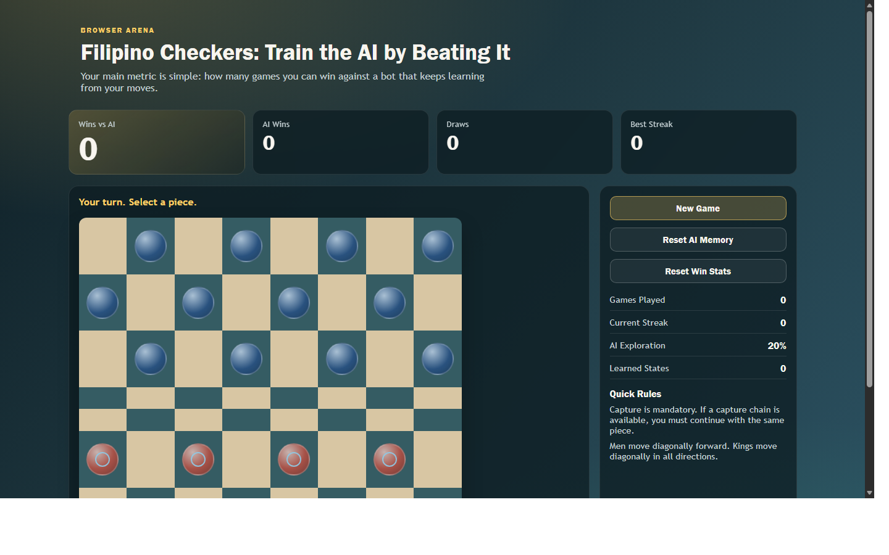

# Filipino Checkers vs Learning AI

This project is now a browser game: **you vs an AI that keeps learning from your games**.

## Preview

The main metric is your pride score:

**Wins vs AI**

Every finished game updates the AI policy using a lightweight reinforcement-learning loop and stores it in `localStorage`, so the bot remembers what it learned between sessions on the same browser.

## Features

- Browser-based Filipino checkers board (no Python required)
- Mandatory captures + chain captures
- Piece promotion to kings
- AI opponent with epsilon-greedy Q-value learning
- Persistent AI memory (`localStorage`)
- Persistent player stats (`Wins vs AI`, streaks, draws, etc.)

## Run Locally

Open `index.html` in a browser.

## Publish on GitHub Pages

1. Push this repo to GitHub.
2. In GitHub, go to `Settings` -> `Pages`.
3. Set `Build and deployment` source to `Deploy from a branch`.
4. Select branch `main` and folder `/ (root)`.
5. Save. GitHub Pages will publish the site.
